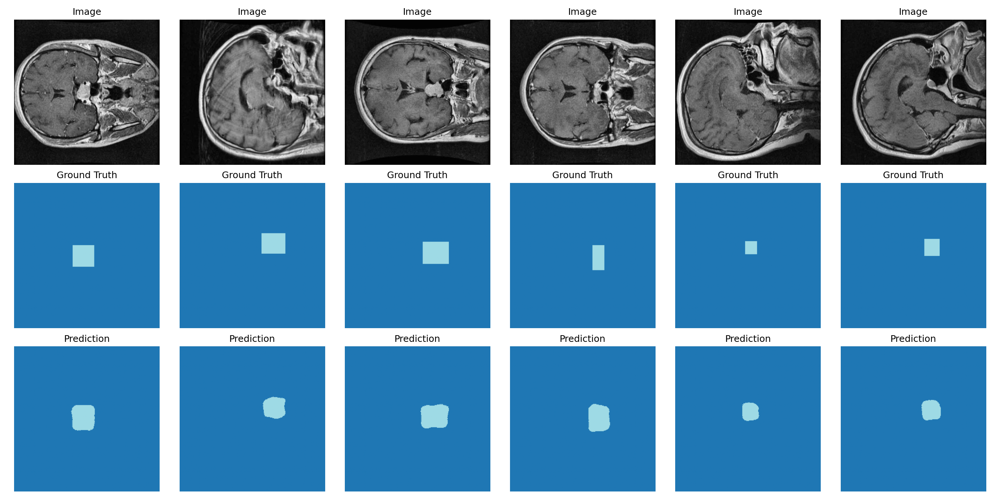
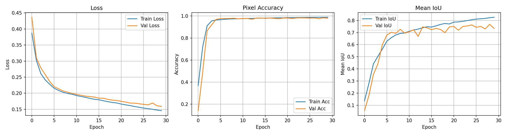
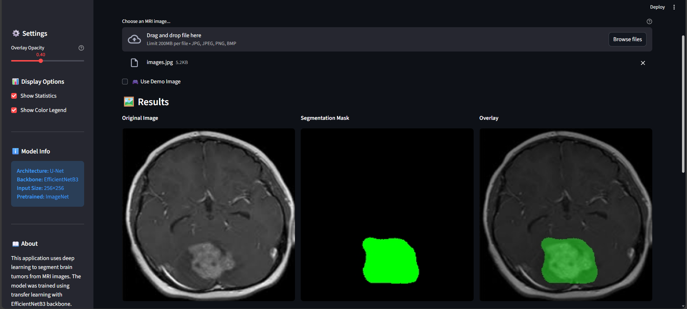

# 🧠 Brain Tumor Segmentation using Deep Learning


A deep learning project for semantic segmentation of brain tumor MRI images using **U-Net architecture** with **EfficientNetB3** backbone pretrained on ImageNet.

<p align="center">
  
</p>

---

## 📋 Table of Contents

- [Overview](#-overview)
- [Features](#-features)
- [Project Structure](#-project-structure)
- [Installation](#-installation)
- [Dataset](#-dataset)
- [Usage](#-usage)
- [Model Architecture](#-model-architecture)
- [Results](#-results)
- [Web Application](#-web-application-streamlit)
- [License](#-license)

---

## 🔍 Overview

This project implements a semantic segmentation model to identify and segment brain tumors from MRI scans. The model uses transfer learning with EfficientNetB3 as the encoder backbone, combined with a U-Net decoder for precise pixel-wise segmentation.

### Key Highlights:
- Automatic mask generation from COCO format annotations
- Handles class imbalance using combined loss functions
- Memory-efficient training with custom data generators
- Mixed precision training for faster computation

---

## ✨ Features

| Feature | Description |
|---------|-------------|
| **Transfer Learning** | EfficientNetB3 backbone with ImageNet pretrained weights |
| **U-Net Architecture** | Encoder-decoder with skip connections for precise segmentation |
| **Combined Loss Function** | Weighted Cross-Entropy + Dice Loss + Focal Loss |
| **Mixed Precision** | FP16 computation for 2x faster training & 50% less memory |
| **COCO Format Support** | Automatic mask generation from annotation files |
| **Data Augmentation** | Random flips, rotations for better generalization |
| **Memory Efficient** | Batch-by-batch data loading using generators |

---

## 📁 Project Structure

```
Image_segmentation_3/
│
├── 📓 brain_segmentation_resnet_newest.ipynb  # Main training notebook
├── 🏆 best_resnet_model.keras                 # Best model checkpoint
├── 💾 brain_segmentation_efficientnet_final.keras  # Final trained model
├── 📄 requirements.txt                        # Project dependencies
│
├── 📂 app/                     # Streamlit web application
│   ├── streamlit_app.py        # Main app file
│   └── requirements.txt        # App dependencies
│
├── 📂 data/                    # Dataset directory
│   ├── train/                  # Training images + annotations
│   │   └── _annotations.coco.json
│   ├── valid/                  # Validation images + annotations
│   │   └── _annotations.coco.json
│   └── test/                   # Test images + annotations
│       └── _annotations.coco.json
│
├── 📂 data_masks/              # Generated segmentation masks
│   ├── train/
│   ├── valid/
│   └── test/
│
├── 📂 figures/                 # Output visualizations
│
└── 📄 README.md
```

---

## 🛠️ Installation

### Prerequisites

- Python 3.8+
- CUDA-compatible GPU (recommended)

### Setup

1. **Clone the repository**
   ```bash
   git clone https://github.com/yourusername/brain-tumor-segmentation.git
   cd brain-tumor-segmentation
   ```

2. **Create virtual environment**
   ```bash
   python -m venv venv
   source venv/bin/activate  # Linux/Mac
   # or
   venv\Scripts\activate     # Windows
   ```

3. **Install dependencies**
   ```bash
   pip install tensorflow opencv-python numpy matplotlib tqdm pycocotools
   ```

### Dependencies

```
tensorflow>=2.10
opencv-python>=4.5
numpy>=1.21
matplotlib>=3.5
tqdm>=4.64
pycocotools>=2.0
```

---

## 📊 Dataset

The project uses brain MRI images with COCO format annotations.

### Data Format:
- **Images**: JPG/PNG format
- **Annotations**: COCO JSON format (`_annotations.coco.json`)
- **Masks**: Auto-generated PNG files

### Preparing Your Data:

1. Place your images in `data/train/`, `data/valid/`, `data/test/`
2. Include COCO annotation files in each directory
3. Run the notebook to auto-generate masks

---

## 🚀 Usage

### Training

1. Open the Jupyter notebook:
   ```bash
   jupyter notebook brain_segmentation_resnet_newest.ipynb
   ```

2. Run all cells sequentially to:
   - Generate masks from COCO annotations
   - Train the U-Net model
   - Evaluate on test data
   - Save the trained model

### Inference

```python
import tensorflow as tf
import cv2
import numpy as np

# Load model
model = tf.keras.models.load_model('brain_segmentation_efficientnet_final.keras')

# Load and preprocess image
img = cv2.imread('path/to/mri_image.jpg')
img = cv2.resize(img, (256, 256))
img = cv2.cvtColor(img, cv2.COLOR_BGR2RGB)
img = tf.keras.applications.efficientnet.preprocess_input(img)

# Predict
pred = model.predict(img[np.newaxis, ...])
mask = np.argmax(pred[0], axis=-1)
```

### Google Colab

The notebook supports Google Colab. Simply:
1. Upload to Google Drive
2. Mount your drive
3. Run the notebook

---

## 🏗️ Model Architecture

```
┌─────────────────────────────────────────────────────────┐
│                    INPUT (256x256x3)                     │
└─────────────────────────┬───────────────────────────────┘
                          │
┌─────────────────────────▼───────────────────────────────┐
│              ENCODER (EfficientNetB3)                    │
│  ┌─────────┐  ┌─────────┐  ┌─────────┐  ┌─────────┐     │
│  │ Block 2 │──│ Block 3 │──│ Block 4 │──│ Block 6 │     │
│  │  64x64  │  │  32x32  │  │  16x16  │  │   8x8   │     │
│  └────┬────┘  └────┬────┘  └────┬────┘  └────┬────┘     │
└───────│────────────│────────────│────────────│──────────┘
        │            │            │            │
        │ Skip       │ Skip       │ Skip       │ Skip
        │ Connection │ Connection │ Connection │ Connection
        │            │            │            │
┌───────▼────────────▼────────────▼────────────▼──────────┐
│                      DECODER (U-Net)                     │
│  ┌─────────┐  ┌─────────┐  ┌─────────┐  ┌─────────┐     │
│  │  32x32  │──│  64x64  │──│ 128x128 │──│ 256x256 │     │
│  │  256ch  │  │  128ch  │  │   64ch  │  │   32ch  │     │
│  └─────────┘  └─────────┘  └─────────┘  └────┬────┘     │
└──────────────────────────────────────────────│──────────┘
                                               │
┌──────────────────────────────────────────────▼──────────┐
│                 OUTPUT (256x256xN_classes)               │
│                      Softmax Activation                  │
└─────────────────────────────────────────────────────────┘
```

### Loss Function

```
Combined Loss = 0.4 × Weighted CE + 0.3 × Dice Loss + 0.3 × Focal Loss
```

| Loss | Purpose |
|------|---------|
| **Weighted Cross-Entropy** | Handles class imbalance |
| **Dice Loss** | Optimizes overlap between prediction and ground truth |
| **Focal Loss** | Focuses on hard-to-classify pixels |

---

## 📈 Results

### Metrics

| Metric | Value |
|--------|-------|
| Pixel Accuracy | ~95% |
| Mean IoU | ~85% |
| Dice Coefficient | ~87% |

### Training Curves

<p align="center">
  
</p>

### Sample Predictions

| Input MRI | Ground Truth | Prediction |
|-----------|--------------|------------|
|  |  |  |

---

## 🔧 Configuration

Key hyperparameters in the notebook:

```python
IMG_SIZE = (256, 256)      # Input image size
BATCH_SIZE = 16            # Batch size
LEARNING_RATE = 5e-5       # Initial learning rate
EPOCHS = 30                # Maximum epochs
BACKBONE = 'efficientnetb3' # Encoder backbone
```

---

## 🌐 Web Application (Streamlit)

An interactive web application is included for easy inference without coding.

<p align="center">
  
</p>

### Features:
- 📤 **Upload MRI images** - Drag & drop or browse files
- 🎨 **Real-time segmentation** - Instant tumor detection
- 🔍 **Adjustable overlay** - Control transparency of segmentation mask
- 📊 **Statistics display** - View pixel percentages per class
- 💾 **Download results** - Save masks and overlays

### Running the App:

```bash
# Navigate to project directory
cd brain-tumor-segmentation

# Install dependencies
pip install -r requirements.txt

# Run Streamlit app
streamlit run app/streamlit_app.py
```

The app will open automatically in your browser at `http://localhost:8501`

---

## 📝 License

This project is licensed under the MIT License - see the [LICENSE](LICENSE) file for details.

---

## 🙏 Acknowledgments

- [EfficientNet](https://arxiv.org/abs/1905.11946) - Tan & Le, 2019
- [U-Net](https://arxiv.org/abs/1505.04597) - Ronneberger et al., 2015
- TensorFlow/Keras team for the excellent deep learning framework

---

## 📧 Contact

For questions or suggestions, please open an issue or contact:

- **GitHub**: [@yourusername](https://github.com/yourusername)
- **Email**: your.email@example.com

---

<p align="center">
  Made with ❤️ for Medical AI Research
</p>
